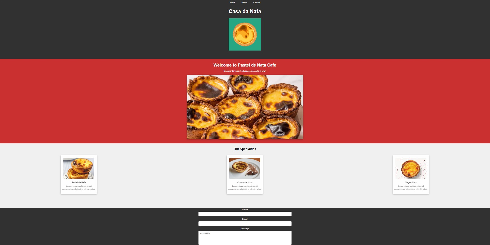

This project is a simple web page introducing Pastel de Nata. The project was developed using HTML and CSS and published using GitHub Pages.

Contents

- [Project URL](#project-urls)
- [Features](#features)
- [Project Content](#project-content)
- [How to Run](#how-to-run)
- [Screenshot](#screenshot)
- [Challenge](#challenge)
- [Technologies Used](#technologies-used)
- [Installation](#installation)
- [Author](#author)
- [License](#license)
- [Show-Your-Support](#show-your-support)

# Project URL

The project is published at: [Simple Design Page](https://mkalkandev.github.io/simple-design-page/)

# Features

- **Responsive Design:** Provides a moderate user experience on all devices. - **Simple and User Friendly Interface:** A simple single page interface

- **Modern HTML and CSS Techniques:** Clean and easy to maintain code structure.

# Project Content

This project contains the following files and folders:

- **index.html:** HTML file of the main page.

- **main.css:** CSS file that creates the design of the project.

- **images/**: Folder containing the images used in the page.

# How to Run?

1. **Download Project File:**
Copy this project to your computer or download it as a ZIP.

```bash
git clone https://mkalkandev.github.io/simple-design-page.git
```

2. **Open HTML File:**
You can view the `index.html` file in the project directory by opening it in any browser.

3. **Access via GitHub Pages:**

You can access the project directly from [Recipe Page]https://mkalkandev.github.io/simple-design-page/

# Screenshot



# Challenge

My app allows users to:

Display the optimal layout for the app based on their device's screen size
See the navigation states for all interactive elements on the page
Continuing development
This was my fifth project involving HTML and CSS and I am happy with the result. This time I tried to learn new things so I tried to structure HTML better and used flex in CSS. I also did a small introduction to Responsive design.

I plan to continue exploring and learning more about this technology so there will definitely be more projects related to it soon.

# Technologies Used

Operating System


Front-end

 


Tools

 

# Installation

To install the project, follow these steps:

Clone the project repository using the following command:

git clone https://github.com/mkalkandev/simple-design-page
Go to the root of the project:

cd simple-design-page/
Install the project dependencies by running the following command:

# Author

👤 MustafaKalkan

Github:<a href="https://github.com/mkalkandev/" target="_blank">@mkalkandev</a>

Frontend Mentor:<a href="https://www.frontendmentor.io/profile/mkalkandev" target="_blank">@mkalkandev</a>

# License

📝 Copyright © 2023 MustafaKalkan.

This project is licensed under [MIT](./LICENSE).

# ShowYourSupport

Have fun building!🚀 
If this project helped you, give it a ⭐️!
